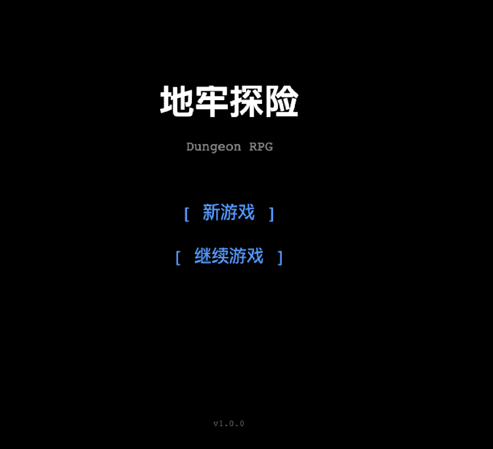
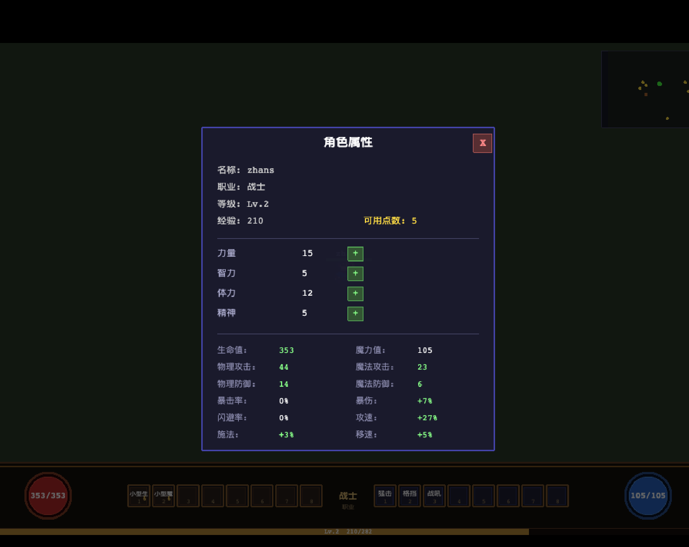
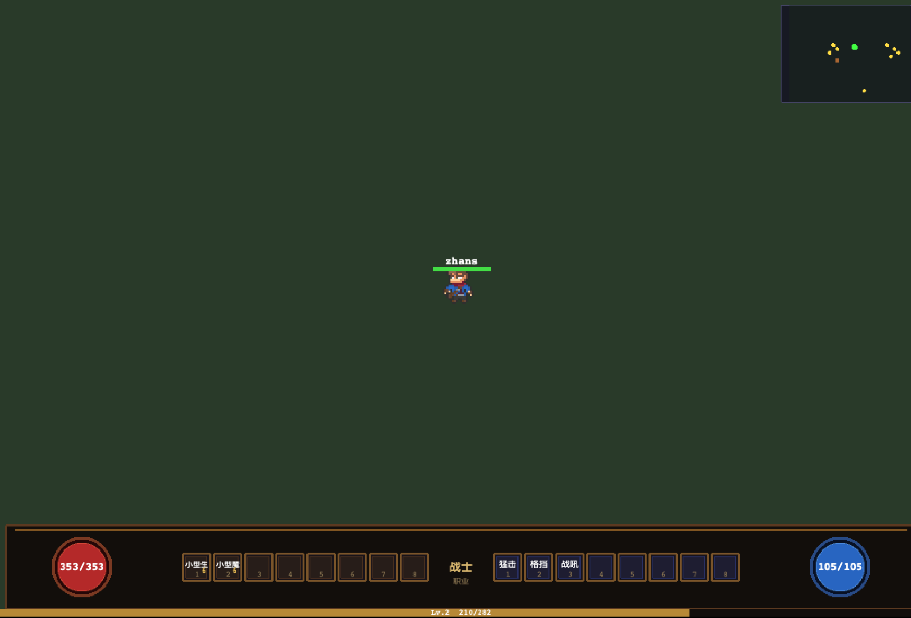
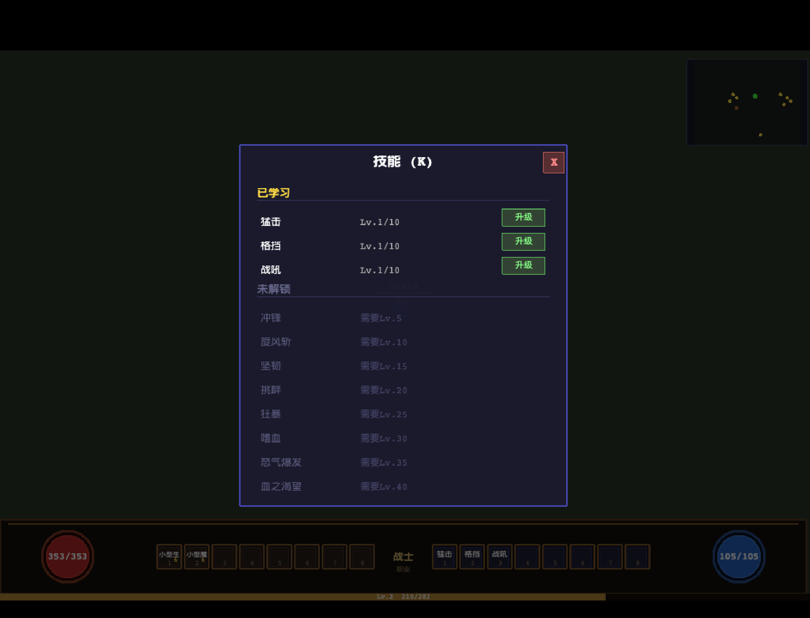
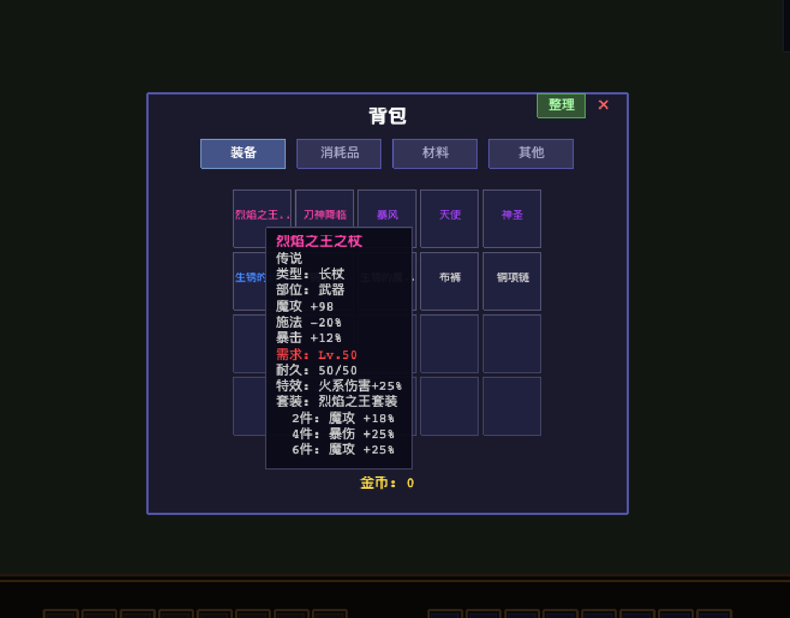

# 地牢探险

> [English](./README.md) | 中文版

一款基于 Phaser 3、TypeScript 和 Vite 构建的 2D 等距像素风地牢探险 RPG。

## 项目预览












## 项目简介

地牢探险是一款实时战斗 RPG ，具备以下核心特性：

- **等距 2D 视角** — 45° 俯视角，支持深度排序
- **双职业选择**：战士（近战物理）、法师（远程魔法）
- **10 层随机地牢**，难度随层数递增
- **深渊模式** — 10% 概率触发，怪物属性×2，专属掉落
- **完整 RPG 系统**：装备、强化、打造、鉴定、背包、技能、Buff 等
- **8 位交互型 NPC**：提供交易、升级、存储等服务

## 核心功能

### 玩法系统

| 功能 | 说明 |
|------|------|
| **职业** | 战士、法师（20 级可转职，6 种转职方向） |
| **等级成长** | 1~60 级，每级 5 点属性点 |
| **技能** | 两职业共约 62 个技能，分主动/被动 |
| **装备** | 687+ 装备（武器、防具、饰品），5 种品质 |
| **深渊装备** | 78 件专属深渊掉落装备 |
| **符文系统** | 5 品质符文，提供属性加成 |
| **炼金系统** | 药水与材料制作配方 |
| **地牢** | 10 层随机地图生成，Boss 房 |

### 成长系统

- **装备强化** — +1~+20 强化等级，含成功率和失败惩罚
- **耐久度与修理** — 装备随使用磨损，铁匠处修理
- **装备分解** — 分解获得强化材料
- **装备鉴定** — 未鉴定装备可在占卜师处鉴定
- **仓库系统** — 银行家处存放物品
- **武器精通** — 武器类型熟练度提供被动加成
- **死亡惩罚** — 损失经验、金币，可能随机掉落物品

### NPC 列表

| NPC | 所在区域 | 功能 |
|-----|----------|------|
| 格雷格（铁匠）| 军事区 | 强化、修理、分解 |
| 商人 | 商业区 | 买卖物品、每日库存 |
| 艾琳（技能导师）| 军事区 | 学习/升级技能 |
| 转职导师 | 军事区 | 20 级转职选择 |
| 银行家 | 冒险者区 | 仓库存储 |
| 占卜师 | 商业区 | 装备鉴定 |
| 炼金师 | 商业区 | 炼金制作 |
| 传送师 | 中心广场 | 楼层传送 |

## 操作方式

| 输入 | 动作 |
|------|------|
| **右键点击地面** | 移动到目标位置 |
| **左键点击怪物** | 选中并攻击 |
| **左键点击 NPC** | 对话/交互 |
| **数字键 1~8** | 使用技能/物品快捷栏 |
| **I** | 开关背包 |
| **E** | 开关装备面板 |
| **C** | 开关角色面板 |
| **M** | 开关小地图（地牢内） |
| **K** | 开关技能面板 |
| **ESC** | 设置/关闭面板 |
| **Space** | 拾取地面物品 |
| **F** | 与最近可交互对象互动 |
| **R** | 坐下休息（回复 HP/MP） |

## 技术栈

- **游戏引擎**：Phaser 3.90
- **编程语言**：TypeScript 6
- **构建工具**：Vite 8
- **包管理器**：pnpm 10

## 项目结构

```
2dgame/
├── src/
│   ├── config/          # 类型定义、全局常量、配置
│   ├── data/            # 静态数据：职业、技能、装备、怪物、NPC 等
│   ├── entities/        # 游戏实体：玩家、怪物、Boss、NPC
│   ├── scenes/          # Phaser 场景：启动、加载、主菜单、城镇、地牢、UI
│   ├── systems/         # 游戏逻辑系统：战斗、背包、技能、地牢、存档等
│   ├── ui/              # UI 组件：面板、HUD、对话框
│   ├── map/            # 房间与走廊生成
│   ├── state/          # 全局游戏状态
│   ├── utils/          # 工具函数：等距坐标、随机数、存档
│   └── main.ts         # 入口文件
├── public/              # 静态资源
├── docs/                # 设计文档
├── package.json
└── README.md
```

## 本地运行

### 前置条件

- Node.js 18+
- 推荐使用 pnpm（或 npm/yarn）

### 安装依赖

```bash
pnpm install
```

### 启动开发服务器

```bash
pnpm dev
```

游戏将在 `http://localhost:3000` 打开。

### 生产构建

```bash
pnpm build
```

产物输出到 `dist/`。

## 详细文档

设计文档位于 `docs/` 目录：

- [游戏设计文档](./docs/game-design.md) — 核心玩法、战斗、成长系统
- [游戏架构文档](./docs/game-architecture.md) — 技术栈、模块设计、数据流
- [操作方式文档](./docs/controls.md) — 完整键位参考
- [开发计划文档](./docs/development-plan.md) — 8 阶段开发路线图
- [NPC 系统文档](./docs/npc-system.md) — NPC 详细设定与服务
- [怪物系统文档](./docs/monster-system.md) — 怪物类型、行为、技能
- [装备系统文档](./docs/equipment-system.md) — 强化、耐久度、套装
- [属性规则文档](./docs/attribute-rules.md) — 属性点分配公式

## 开发进度

**阶段一~已完成**（最小可玩版本）：

- 主菜单 → 角色创建 → 城镇 → 地牢探索
- 实时战斗系统（普通怪物、Boss）
- 所有 UI 面板（背包、装备、技能、商店、强化、修理、打造、鉴定、仓库、存档、死亡、深渊选择）
- 完整 NPC 交互流程
- 存档系统（多槽位、自动存档）

**阶段七~八进行中**：视觉优化、数值平衡、内容扩展。

## 许可证

ISC

---

*版本 1.0.0 — 基于 Phaser 3 + TypeScript + Vite 构建*
